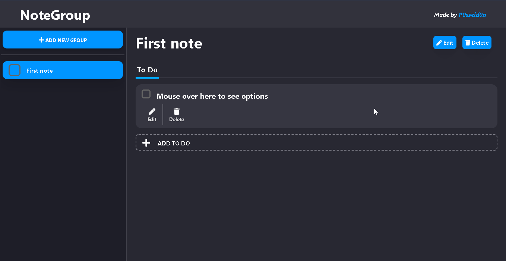

<h2 align="center">NoteGroup</h2>

NoteGroup is a ToDo list stored in groups.

___

  

___

<h3 align="center">
  <a href="#rocket-tecnologias-utilizadas">Tecnologias</a>&nbsp;|&nbsp;
  <a href="#link-como-contribuir">Como Contribuir</a>&nbsp;|&nbsp;
  <a href="#licença">Licença</a>
</h3>

___

## :rocket: Tecnologias Utilizadas 

O projeto foi desenvolvido utilizando as seguintes tecnologias

- VueJS
- SASS

## :link: Como contribuir 

- Faça um Fork do repositório
- Clone o seu repositório
- Crie uma branch com a sua feature
- Faça um commit com suas mudanças
- 'Push' a sua branch
- Ir em Pull Requests do projeto original e criar uma pull request com o seu commit

## Licença 

Esse projeto está sob a licença MIT. Veja o arquivo [LICENSE](LICENSE) para mais detalhes.